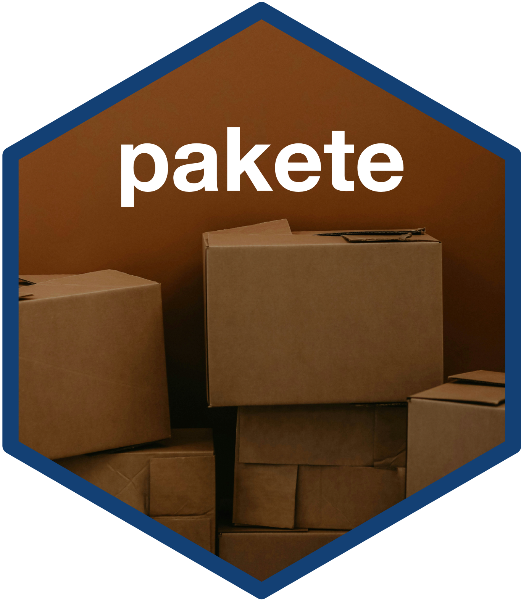

<!-- README.md is generated from README.Rmd. Please edit that file -->

```{r, include = FALSE}
knitr::opts_chunk$set(
  collapse = TRUE,
  comment = "#>",
  fig.path = "man/figures/README-",
  out.width = "100%"
)
```

# pakete: Utilities for Package Development 

<!-- badges: start -->
[](https://www.repostatus.org/#wip)
[](https://lifecycle.r-lib.org/articles/stages.html#experimental)
[](https://github.com/katilingban/pakete/actions/workflows/R-CMD-check.yaml)
[](https://github.com/katilingban/pakete/actions/workflows/test-coverage.yaml)
[](https://codecov.io/gh/katilingban/pakete)
[](https://www.codefactor.io/repository/github/katilingban/pakete)
[](https://zenodo.org/badge/latestdoi/790010725)
<!-- badges: end -->

Tools and utilities for package development currently not available from usual development tools. These are mostly linked to personal preferences during the development process. They assist in making routine and repetitive tasks easily implementable.

## What does `pakete` do?

Currently, `pakete` includes functions for:

1. creating GitHub checklists for tasks in the package submission process;

2. creating `CONTRIBUTING.md` file;

3. adding `repostatus` badge; and,

4. adding Zenodo DOI badge.

## Installation

You can install `pakete` via the [Katilingban R-universe](https://katilingban.r-universe.dev) as follows:

```{r install-r-universe, eval = FALSE}
install.packages(
  "pakete",
  repos = c('https://katilingban.r-universe.dev', 'https://cloud.r-project.org')
)
```

## Usage

### Creating GitHub issues checklist template for CRAN submissions

It is useful for some to have a checklist of tasks to be done as part of the CRAN submission process. The [*Releasing to CRAN*](https://r-pkgs.org/release.html) chapter of the second edition of the R packages book provides good templates for tasks to do for an [initial CRAN release](https://r-pkgs.org/release.html#sec-release-initial), an [update CRAN release](https://r-pkgs.org/release.html#keeping-up-with-change), a [submission of package to CRAN](https://r-pkgs.org/release.html#sec-release-process), and a [post-acceptance to CRAN](https://r-pkgs.org/release.html#sec-release-post-acceptance).

The function `add_issue_template()` assists in creating a GitHub issue template for your package repository for each of these stages of preparing for, submitting to, and getting accepted by CRAN. So, if you want to setup an issues checklist that you can use for preparing to submit to CRAN for an initial release, use:

```{r issue-template, eval = FALSE}
library(pakete)

add_issue_template("initial-cran-release")
```

This will create a markdown file called `initial-cran-release.md` inside the `.github/ISSUE_TEMPLATE` directory (this will be created if it doesn't exist yet) which is where GitHub looks for issue templates to use.

Then, once you commit and push this to your GitHub remote repository and merge it to your `main` branch, you will now see a choice of **Initial CRAN release** to use as a template whenever you open a new issue.

### Creating a CONTRIBUTING.md file

If you need help with getting specific language for a `CONTRIBUTING.md` document in your repository, you may want to consider using the template available from this package as follows:

```{r contributing-file, eval = FALSE}
add_contributing(repo = "YOUR_GITHUB_USERNAME/YOUR_REPO_NAME")
```

This will create a `CONTRIBUTING.md` file within the `.github` directory (this will be created if it doesn't exist). Do note that the contributing process described in this markdown document is the preferred process of those who developed the `pakete` package. If you are starting out and need something to use or something to build on, then this can help.

### Adding a `repostatus` badge

If you would like to add one of the badges from [`repostatus`](https://www.repostatus.org/) to signify the development status of your project, you can do so as follows:

```{r repostatus-badge, eval = FALSE}
add_badge_status("wip")
```

This will add a status badge to your README file in the block where badges are usually placed.

### Adding a Zenodo badge

If you use Zenodo and would like to add a Zenodo badge to your README (even if you haven't made a release for your repository/project), you can use the `add_badge_zenodo()` function as follows:

```{r zenodo-badge, eval = FALSE}
add_badge_zenodo(repo = "YOUR_GITHUB_USERNAME/YOUR_REPO_NAME")
```

This will add a Zenodo badge to your README file in the block were badges are usually placed. Please note that whilst this can be used to add a Zenodo badge even if you haven't made a GitHub release yet, the actual badge will only appear and the DOI assigned to your repository will only be issued once you have made your first GitHub release. Hence, you should only do this either as a post-acceptance to CRAN step when you will make your first GitHub release after your CRAN release or as part of a GitHub pre-release to activate a DOI for your repository. It would not be advisable to add this badge to your README without a GitHub release before you submit to CRAN as you will have check errors in relation to the Zenodo release URL.

## Citation

If you find the `pakete` package useful please cite using the suggested citation provided by a call to the `citation()` function as follows:

```{r citation}
citation("pakete")
```

## Community guidelines

Feedback, bug reports and feature requests are welcome; file issues or seek support [here](https://github.com/katilingban/pakete/issues). If you would like to contribute to the package, please see our [contributing guidelines](https://katilingban.io/pakete/CONTRIBUTING.html).

Please note that the `pakete` project is released with a [Contributor Code of Conduct](https://katilingban.io/pakete/CODE_OF_CONDUCT.html). By contributing to this project, you agree to abide by its terms.

